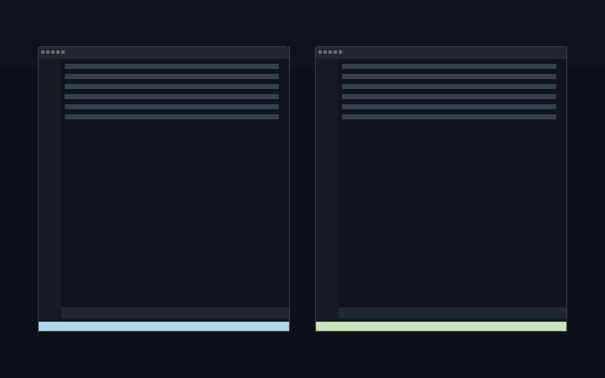
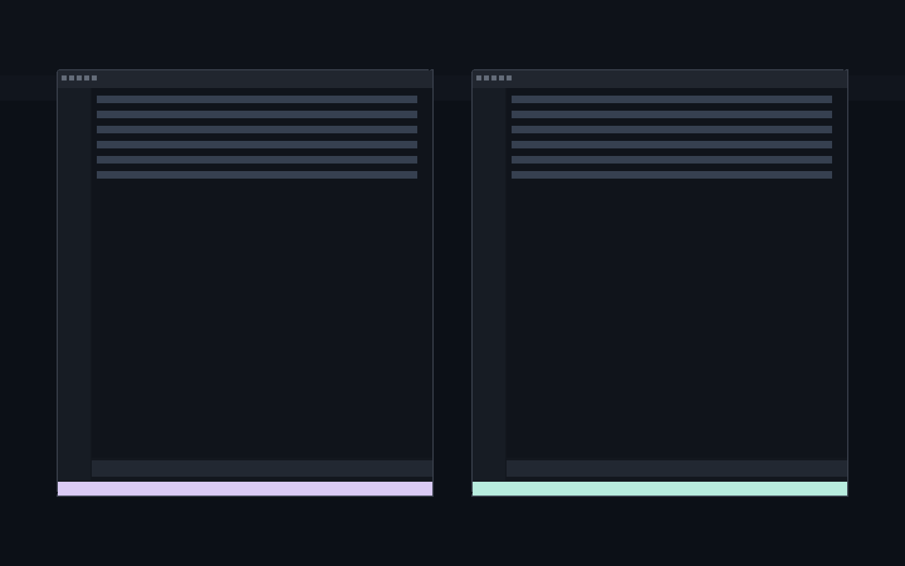

# Cursor Worktree Colors

`Cursor Worktree Colors` assigns a stable pastel status bar color per git worktree so multiple Cursor windows are visually distinct.

## Behavior

- Uses the current workspace's git worktree identity as a deterministic seed.
- Applies color to:
  - `statusBar.background`
  - `statusBar.foreground`
  - `statusBar.debuggingBackground`
  - `statusBar.noFolderBackground`
- Reapplies on workspace/configuration changes.

## Settings

- `cursorWorktreeColors.enabled` (default: `true`)
- `cursorWorktreeColors.saturation` (default: `44`)
- `cursorWorktreeColors.lightness` (default: `78`)

## Notes

- Colors are written to workspace setting `workbench.colorCustomizations`.
- Disabling the extension setting removes only keys managed by this extension.

## Screenshots

